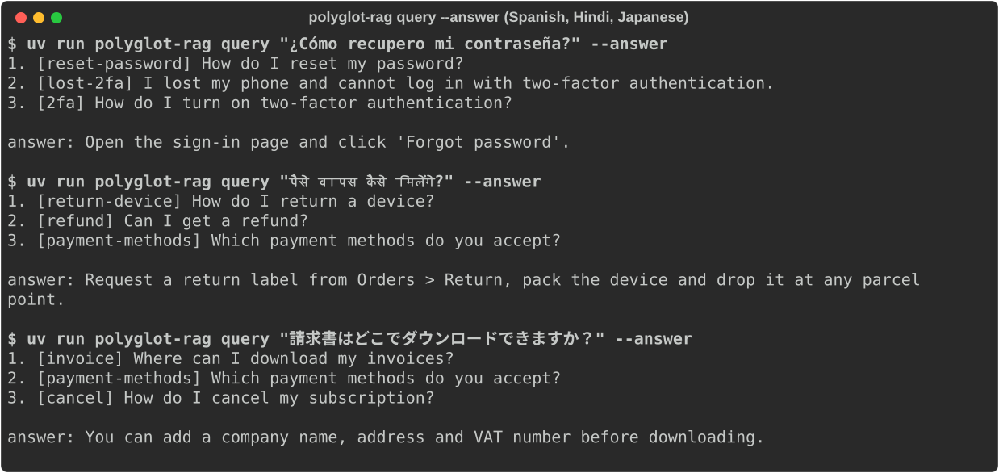

# polyglot-rag

> **Credits.** Built by Amaan Mithani with Claude (Anthropic) as the AI coding assistant.

Multilingual retrieval for customer-support RAG, plus a 24-language accuracy
table where every number comes from a committed JSON file.

It has three retrievers over one corpus:

- **BM25**: a small numpy Okapi BM25. The tokenizer knows about scripts: it keeps
  Indic vowel signs and viramas inside words, and it splits Chinese, Japanese,
  Thai, Lao, Khmer and Myanmar text into character bigrams.
- **Dense**: [`intfloat/multilingual-e5-small`](https://huggingface.co/intfloat/multilingual-e5-small)
  (118M params, about 470 MB), run on CPU through sentence-transformers, with an
  embedding cache on disk.
- **Hybrid**: Reciprocal Rank Fusion (k = 60) over the top 100 results from each
  retriever.

It also has a **cross-lingual mode**: the query is in language X and the passages
are in English. A small **extractive answer layer** returns the sentence of the
top passage that is closest to the query. The project uses no LLM and makes no
API calls.

## See it running



Three real `query --answer` runs (default dense retriever, multilingual-e5-small on CPU) against the bundled English support FAQ, with the questions in Spanish, Hindi and Japanese. Output is unedited, misses included: the Hindi "how do I get my money back?" ranks `return-device` above `refund`, and the Japanese answer sentence is a neighbour of the one you'd want.

## Quick start

```bash
uv sync --extra dense                       # the dense extra pulls torch + sentence-transformers
uv run polyglot-rag eval --langs all --n 200   # download data, build indexes, evaluate, write results/belebele.json
uv run polyglot-rag report                  # regenerate the table below from results/belebele.json
uv run polyglot-rag query "¿Cómo recupero mi contraseña?" --answer
uv run polyglot-rag query "पैसे वापस कैसे मिलेंगे?" --method dense --json
```

`query` searches a bundled, **illustrative** support FAQ by default
(`src/polyglot_rag/support_faq.jsonl`: 28 English articles for a fictional
product). To search your own corpus, pass `--corpus your.jsonl`. It needs one
`{"id", "title", "text"}` object per line.

Useful flags:

- `--method bm25|dense|hybrid`
- `--model e5-small|minilm|hashing|<hf id>`. `hashing` is an offline
  character-n-gram embedder with no download. It carries no meaning and is only
  for tests and smoke runs.
- `--modes mono,cross`
- `--seed`
- `--boot`

The first eval run downloads about 45 MB of Belebele JSONL and about 470 MB of
model weights. The committed run (24 languages, `--n 200`, mono and cross) took
`meta.runtime_seconds` in the JSON (about 8 minutes) on an 8-core Apple-silicon CPU.

## Results

<!-- RESULTS:START -->
_Generated by `polyglot-rag report` from [`results/belebele.json`](results/belebele.json). Do not edit by hand._

Dataset `facebook/belebele` @ `7899cdfa4e`; 200 of 900 questions per language (seed 13, identical question ids in every language); embedder `intfloat/multilingual-e5-small`; BM25 k1=1.2 b=0.75; RRF k=60; 1000 bootstrap resamples.

### Monolingual (query and passages in the same language)

| Language | Code | n | BM25 R@10 | Dense R@10 | Hybrid (RRF) R@5 | Hybrid (RRF) R@10 [95% CI] | Hybrid (RRF) MRR@10 [95% CI] | vs English (R@10) |
|---|---|---|---|---|---|---|---|---|
| English | `eng_Latn` | 200 | 0.935 | 0.985 | 0.960 | 0.965 [0.94, 0.99] | 0.932 [0.90, 0.96] | reference |
| German | `deu_Latn` | 200 | 0.840 | 0.955 | 0.880 | 0.920 [0.89, 0.95] | 0.839 [0.79, 0.88] | -0.045 [-0.08, -0.01] (below EN) |
| French | `fra_Latn` | 200 | 0.910 | 0.975 | 0.940 | 0.965 [0.94, 0.99] | 0.895 [0.85, 0.93] | +0.000 [-0.02, +0.02] |
| Spanish | `spa_Latn` | 200 | 0.900 | 0.965 | 0.920 | 0.930 [0.90, 0.96] | 0.882 [0.84, 0.92] | -0.035 [-0.07, -0.01] (below EN) |
| Portuguese | `por_Latn` | 200 | 0.900 | 0.955 | 0.920 | 0.940 [0.91, 0.97] | 0.888 [0.84, 0.93] | -0.025 [-0.05, +0.00] |
| Italian | `ita_Latn` | 200 | 0.915 | 0.975 | 0.950 | 0.960 [0.93, 0.98] | 0.918 [0.88, 0.95] | -0.005 [-0.04, +0.03] |
| Dutch | `nld_Latn` | 200 | 0.875 | 0.980 | 0.910 | 0.930 [0.90, 0.96] | 0.857 [0.81, 0.90] | -0.035 [-0.07, -0.01] (below EN) |
| Polish | `pol_Latn` | 200 | 0.760 | 0.970 | 0.805 | 0.820 [0.77, 0.87] | 0.743 [0.68, 0.80] | -0.145 [-0.20, -0.10] (below EN) |
| Russian | `rus_Cyrl` | 200 | 0.805 | 0.965 | 0.850 | 0.870 [0.82, 0.92] | 0.812 [0.76, 0.86] | -0.095 [-0.14, -0.04] (below EN) |
| Ukrainian | `ukr_Cyrl` | 200 | 0.805 | 0.955 | 0.855 | 0.870 [0.82, 0.92] | 0.808 [0.76, 0.86] | -0.095 [-0.14, -0.05] (below EN) |
| Turkish | `tur_Latn` | 200 | 0.860 | 0.950 | 0.865 | 0.880 [0.83, 0.93] | 0.826 [0.78, 0.87] | -0.085 [-0.13, -0.05] (below EN) |
| Arabic | `arb_Arab` | 200 | 0.855 | 0.970 | 0.905 | 0.910 [0.87, 0.95] | 0.841 [0.79, 0.89] | -0.055 [-0.10, -0.02] (below EN) |
| Hebrew | `heb_Hebr` | 200 | 0.825 | 0.925 | 0.860 | 0.885 [0.83, 0.93] | 0.794 [0.75, 0.84] | -0.080 [-0.12, -0.04] (below EN) |
| Hindi | `hin_Deva` | 200 | 0.785 | 0.915 | 0.860 | 0.900 [0.86, 0.94] | 0.786 [0.73, 0.83] | -0.065 [-0.11, -0.03] (below EN) |
| Bengali | `ben_Beng` | 200 | 0.780 | 0.930 | 0.835 | 0.870 [0.82, 0.92] | 0.788 [0.74, 0.84] | -0.095 [-0.14, -0.06] (below EN) |
| Tamil | `tam_Taml` | 200 | 0.730 | 0.885 | 0.780 | 0.835 [0.78, 0.89] | 0.715 [0.66, 0.77] | -0.130 [-0.18, -0.09] (below EN) |
| Chinese (Simpl.) | `zho_Hans` | 200 | 0.950 | 0.965 | 0.960 | 0.975 [0.95, 0.99] | 0.929 [0.90, 0.96] | +0.010 [-0.01, +0.04] |
| Japanese | `jpn_Jpan` | 200 | 0.930 | 0.970 | 0.950 | 0.975 [0.95, 0.99] | 0.911 [0.88, 0.94] | +0.010 [-0.02, +0.04] |
| Korean | `kor_Hang` | 200 | 0.675 | 0.955 | 0.790 | 0.810 [0.76, 0.86] | 0.704 [0.65, 0.76] | -0.155 [-0.21, -0.10] (below EN) |
| Vietnamese | `vie_Latn` | 200 | 0.955 | 0.965 | 0.970 | 0.995 [0.98, 1.00] | 0.911 [0.88, 0.94] | +0.030 [+0.01, +0.06] |
| Thai | `tha_Thai` | 200 | 0.820 | 0.935 | 0.900 | 0.920 [0.88, 0.95] | 0.809 [0.76, 0.86] | -0.045 [-0.09, -0.01] (below EN) |
| Indonesian | `ind_Latn` | 200 | 0.935 | 0.960 | 0.950 | 0.960 [0.94, 0.98] | 0.900 [0.86, 0.93] | -0.005 [-0.03, +0.01] |
| Swahili | `swh_Latn` | 200 | 0.935 | 0.925 | 0.950 | 0.970 [0.94, 0.99] | 0.874 [0.84, 0.91] | +0.005 [-0.02, +0.04] |
| Yoruba | `yor_Latn` | 200 | 0.370 | 0.420 | 0.420 | 0.510 [0.44, 0.57] | 0.330 [0.28, 0.39] | -0.455 [-0.53, -0.39] (below EN) |
| **Macro avg** | 24 langs | - | 0.835 | 0.931 | 0.874 | 0.898 [0.89, 0.91] | 0.821 [0.81, 0.83] |  |

### Cross-lingual (query in language X, passages in English)

| Language | Code | n | BM25 R@10 | Dense R@10 | Hybrid (RRF) R@5 | Hybrid (RRF) R@10 [95% CI] | Hybrid (RRF) MRR@10 [95% CI] |
|---|---|---|---|---|---|---|---|
| German | `deu_Latn` | 200 | 0.365 | 0.945 | 0.495 | 0.610 [0.54, 0.68] | 0.447 [0.38, 0.52] |
| French | `fra_Latn` | 200 | 0.480 | 0.950 | 0.560 | 0.640 [0.57, 0.70] | 0.542 [0.48, 0.60] |
| Spanish | `spa_Latn` | 200 | 0.340 | 0.955 | 0.410 | 0.480 [0.41, 0.55] | 0.370 [0.31, 0.43] |
| Portuguese | `por_Latn` | 200 | 0.330 | 0.910 | 0.450 | 0.520 [0.45, 0.58] | 0.390 [0.33, 0.45] |
| Italian | `ita_Latn` | 200 | 0.385 | 0.925 | 0.475 | 0.530 [0.46, 0.59] | 0.421 [0.36, 0.49] |
| Dutch | `nld_Latn` | 200 | 0.390 | 0.925 | 0.490 | 0.560 [0.49, 0.63] | 0.438 [0.37, 0.50] |
| Polish | `pol_Latn` | 200 | 0.235 | 0.900 | 0.355 | 0.465 [0.40, 0.54] | 0.301 [0.25, 0.36] |
| Russian | `rus_Cyrl` | 200 | 0.090 | 0.915 | 0.220 | 0.345 [0.28, 0.41] | 0.179 [0.13, 0.23] |
| Ukrainian | `ukr_Cyrl` | 200 | 0.055 | 0.885 | 0.185 | 0.305 [0.24, 0.37] | 0.145 [0.10, 0.19] |
| Turkish | `tur_Latn` | 200 | 0.315 | 0.850 | 0.405 | 0.505 [0.43, 0.57] | 0.375 [0.32, 0.44] |
| Arabic | `arb_Arab` | 200 | 0.045 | 0.845 | 0.155 | 0.315 [0.25, 0.38] | 0.116 [0.08, 0.15] |
| Hebrew | `heb_Hebr` | 200 | 0.075 | 0.800 | 0.190 | 0.295 [0.23, 0.36] | 0.145 [0.10, 0.19] |
| Hindi | `hin_Deva` | 200 | 0.040 | 0.895 | 0.180 | 0.320 [0.26, 0.39] | 0.115 [0.08, 0.15] |
| Bengali | `ben_Beng` | 200 | 0.035 | 0.865 | 0.145 | 0.300 [0.23, 0.37] | 0.108 [0.08, 0.14] |
| Tamil | `tam_Taml` | 200 | 0.040 | 0.770 | 0.140 | 0.275 [0.21, 0.33] | 0.118 [0.08, 0.16] |
| Chinese (Simpl.) | `zho_Hans` | 200 | 0.070 | 0.850 | 0.200 | 0.335 [0.27, 0.40] | 0.144 [0.10, 0.19] |
| Japanese | `jpn_Jpan` | 200 | 0.070 | 0.895 | 0.215 | 0.415 [0.34, 0.48] | 0.161 [0.12, 0.21] |
| Korean | `kor_Hang` | 200 | 0.075 | 0.820 | 0.175 | 0.330 [0.27, 0.40] | 0.143 [0.10, 0.19] |
| Vietnamese | `vie_Latn` | 200 | 0.345 | 0.855 | 0.450 | 0.510 [0.44, 0.57] | 0.386 [0.32, 0.45] |
| Thai | `tha_Thai` | 200 | 0.140 | 0.830 | 0.260 | 0.425 [0.35, 0.49] | 0.222 [0.17, 0.27] |
| Indonesian | `ind_Latn` | 200 | 0.380 | 0.900 | 0.470 | 0.590 [0.52, 0.66] | 0.438 [0.37, 0.50] |
| Swahili | `swh_Latn` | 200 | 0.330 | 0.720 | 0.405 | 0.435 [0.36, 0.50] | 0.349 [0.29, 0.41] |
| Yoruba | `yor_Latn` | 200 | 0.345 | 0.395 | 0.360 | 0.395 [0.33, 0.46] | 0.315 [0.26, 0.38] |
| **Macro avg** | 23 langs | - | 0.216 | 0.852 | 0.321 | 0.430 [0.42, 0.45] | 0.277 [0.27, 0.29] |

### Findings (auto-generated from the JSON)

- Lowest monolingual hybrid R@10: Yoruba (0.510), Korean (0.810), Polish (0.820).
- Significantly below English (paired bootstrap 95% CI of the R@10 gap excludes 0): German, Spanish, Dutch, Polish, Russian, Ukrainian, Turkish, Arabic, Hebrew, Hindi, Bengali, Tamil, Korean, Thai, Yoruba.
- Hybrid significantly beats dense-only on R@10 in 3/24 languages and is significantly worse in 9 (Spanish, Dutch, Polish, Russian, Ukrainian, Turkish, Arabic, Bengali, Korean).
- Macro R@10, monolingual -> cross-lingual (query in X, English corpus; note the cross-lingual macro excludes English): BM25 0.835 -> 0.216; Dense 0.931 -> 0.852; Hybrid (RRF) 0.898 -> 0.430.

<details><summary>All methods x all metrics, monolingual (95% CIs)</summary>

| Language | BM25 recall@5 | BM25 recall@10 | BM25 mrr@10 | Dense recall@5 | Dense recall@10 | Dense mrr@10 | Hybrid (RRF) recall@5 | Hybrid (RRF) recall@10 | Hybrid (RRF) mrr@10 |
|---|---|---|---|---|---|---|---|---|---|
| `eng_Latn` | 0.915 [0.88, 0.95] | 0.935 [0.90, 0.96] | 0.853 [0.81, 0.90] | 0.970 [0.94, 0.99] | 0.985 [0.97, 1.00] | 0.938 [0.91, 0.96] | 0.960 [0.94, 0.98] | 0.965 [0.94, 0.99] | 0.932 [0.90, 0.96] |
| `deu_Latn` | 0.820 [0.77, 0.88] | 0.840 [0.79, 0.89] | 0.725 [0.67, 0.78] | 0.950 [0.92, 0.98] | 0.955 [0.93, 0.98] | 0.899 [0.86, 0.93] | 0.880 [0.83, 0.93] | 0.920 [0.89, 0.95] | 0.839 [0.79, 0.88] |
| `fra_Latn` | 0.875 [0.82, 0.92] | 0.910 [0.87, 0.94] | 0.830 [0.78, 0.87] | 0.940 [0.91, 0.97] | 0.975 [0.95, 0.99] | 0.891 [0.85, 0.93] | 0.940 [0.91, 0.97] | 0.965 [0.94, 0.99] | 0.895 [0.85, 0.93] |
| `spa_Latn` | 0.880 [0.83, 0.93] | 0.900 [0.85, 0.94] | 0.782 [0.73, 0.83] | 0.940 [0.91, 0.97] | 0.965 [0.94, 0.99] | 0.902 [0.86, 0.93] | 0.920 [0.89, 0.95] | 0.930 [0.90, 0.96] | 0.882 [0.84, 0.92] |
| `por_Latn` | 0.865 [0.81, 0.91] | 0.900 [0.85, 0.94] | 0.800 [0.75, 0.85] | 0.920 [0.88, 0.95] | 0.955 [0.93, 0.98] | 0.872 [0.83, 0.91] | 0.920 [0.88, 0.95] | 0.940 [0.91, 0.97] | 0.888 [0.84, 0.93] |
| `ita_Latn` | 0.890 [0.84, 0.93] | 0.915 [0.88, 0.95] | 0.833 [0.78, 0.88] | 0.960 [0.93, 0.98] | 0.975 [0.95, 0.99] | 0.923 [0.89, 0.95] | 0.950 [0.92, 0.97] | 0.960 [0.93, 0.98] | 0.918 [0.88, 0.95] |
| `nld_Latn` | 0.830 [0.78, 0.88] | 0.875 [0.83, 0.92] | 0.723 [0.67, 0.77] | 0.960 [0.93, 0.98] | 0.980 [0.96, 0.99] | 0.899 [0.86, 0.93] | 0.910 [0.87, 0.94] | 0.930 [0.90, 0.96] | 0.857 [0.81, 0.90] |
| `pol_Latn` | 0.675 [0.61, 0.74] | 0.760 [0.69, 0.82] | 0.595 [0.53, 0.66] | 0.960 [0.93, 0.98] | 0.970 [0.94, 0.99] | 0.888 [0.85, 0.92] | 0.805 [0.74, 0.86] | 0.820 [0.77, 0.87] | 0.743 [0.68, 0.80] |
| `rus_Cyrl` | 0.780 [0.72, 0.83] | 0.805 [0.74, 0.86] | 0.684 [0.62, 0.74] | 0.950 [0.92, 0.98] | 0.965 [0.94, 0.98] | 0.904 [0.87, 0.94] | 0.850 [0.80, 0.90] | 0.870 [0.82, 0.92] | 0.812 [0.76, 0.86] |
| `ukr_Cyrl` | 0.770 [0.71, 0.82] | 0.805 [0.75, 0.86] | 0.675 [0.62, 0.73] | 0.930 [0.90, 0.96] | 0.955 [0.93, 0.98] | 0.909 [0.87, 0.94] | 0.855 [0.81, 0.90] | 0.870 [0.82, 0.92] | 0.808 [0.76, 0.86] |
| `tur_Latn` | 0.815 [0.76, 0.87] | 0.860 [0.81, 0.91] | 0.726 [0.67, 0.78] | 0.935 [0.90, 0.96] | 0.950 [0.92, 0.98] | 0.878 [0.84, 0.91] | 0.865 [0.81, 0.91] | 0.880 [0.83, 0.93] | 0.826 [0.78, 0.87] |
| `arb_Arab` | 0.815 [0.76, 0.87] | 0.855 [0.80, 0.91] | 0.711 [0.66, 0.76] | 0.925 [0.89, 0.96] | 0.970 [0.94, 0.99] | 0.877 [0.84, 0.91] | 0.905 [0.86, 0.94] | 0.910 [0.87, 0.95] | 0.841 [0.79, 0.89] |
| `heb_Hebr` | 0.785 [0.73, 0.84] | 0.825 [0.78, 0.88] | 0.709 [0.65, 0.77] | 0.890 [0.84, 0.93] | 0.925 [0.89, 0.96] | 0.840 [0.79, 0.89] | 0.860 [0.81, 0.91] | 0.885 [0.83, 0.93] | 0.794 [0.75, 0.84] |
| `hin_Deva` | 0.760 [0.69, 0.82] | 0.785 [0.73, 0.84] | 0.656 [0.59, 0.71] | 0.870 [0.82, 0.92] | 0.915 [0.87, 0.95] | 0.811 [0.76, 0.86] | 0.860 [0.81, 0.91] | 0.900 [0.86, 0.94] | 0.786 [0.73, 0.83] |
| `ben_Beng` | 0.735 [0.67, 0.79] | 0.780 [0.72, 0.83] | 0.664 [0.60, 0.72] | 0.875 [0.83, 0.92] | 0.930 [0.90, 0.96] | 0.802 [0.75, 0.85] | 0.835 [0.79, 0.89] | 0.870 [0.82, 0.92] | 0.788 [0.74, 0.84] |
| `tam_Taml` | 0.690 [0.62, 0.75] | 0.730 [0.67, 0.79] | 0.620 [0.56, 0.68] | 0.845 [0.79, 0.90] | 0.885 [0.84, 0.93] | 0.753 [0.70, 0.80] | 0.780 [0.72, 0.83] | 0.835 [0.78, 0.89] | 0.715 [0.66, 0.77] |
| `zho_Hans` | 0.930 [0.89, 0.96] | 0.950 [0.92, 0.98] | 0.874 [0.83, 0.91] | 0.955 [0.93, 0.98] | 0.965 [0.94, 0.99] | 0.918 [0.89, 0.95] | 0.960 [0.93, 0.98] | 0.975 [0.95, 0.99] | 0.929 [0.90, 0.96] |
| `jpn_Jpan` | 0.880 [0.83, 0.93] | 0.930 [0.90, 0.96] | 0.804 [0.76, 0.85] | 0.945 [0.91, 0.97] | 0.970 [0.94, 0.99] | 0.888 [0.85, 0.92] | 0.950 [0.92, 0.97] | 0.975 [0.95, 0.99] | 0.911 [0.88, 0.94] |
| `kor_Hang` | 0.605 [0.54, 0.67] | 0.675 [0.61, 0.73] | 0.538 [0.47, 0.60] | 0.930 [0.90, 0.96] | 0.955 [0.93, 0.98] | 0.868 [0.83, 0.91] | 0.790 [0.73, 0.84] | 0.810 [0.76, 0.86] | 0.704 [0.65, 0.76] |
| `vie_Latn` | 0.935 [0.90, 0.96] | 0.955 [0.93, 0.98] | 0.856 [0.81, 0.89] | 0.935 [0.90, 0.96] | 0.965 [0.94, 0.99] | 0.873 [0.83, 0.91] | 0.970 [0.94, 0.99] | 0.995 [0.98, 1.00] | 0.911 [0.88, 0.94] |
| `tha_Thai` | 0.770 [0.71, 0.83] | 0.820 [0.77, 0.87] | 0.704 [0.65, 0.76] | 0.895 [0.85, 0.94] | 0.935 [0.90, 0.96] | 0.844 [0.80, 0.89] | 0.900 [0.85, 0.94] | 0.920 [0.88, 0.95] | 0.809 [0.76, 0.86] |
| `ind_Latn` | 0.900 [0.85, 0.94] | 0.935 [0.91, 0.96] | 0.836 [0.79, 0.88] | 0.940 [0.91, 0.97] | 0.960 [0.93, 0.98] | 0.893 [0.85, 0.93] | 0.950 [0.92, 0.97] | 0.960 [0.94, 0.98] | 0.900 [0.86, 0.93] |
| `swh_Latn` | 0.895 [0.85, 0.94] | 0.935 [0.90, 0.96] | 0.827 [0.78, 0.87] | 0.905 [0.86, 0.94] | 0.925 [0.89, 0.96] | 0.800 [0.75, 0.85] | 0.950 [0.92, 0.98] | 0.970 [0.94, 0.99] | 0.874 [0.84, 0.91] |
| `yor_Latn` | 0.310 [0.25, 0.37] | 0.370 [0.30, 0.43] | 0.241 [0.19, 0.29] | 0.340 [0.28, 0.41] | 0.420 [0.35, 0.49] | 0.282 [0.23, 0.34] | 0.420 [0.35, 0.49] | 0.510 [0.44, 0.57] | 0.330 [0.28, 0.39] |

</details>

<details><summary>All methods x all metrics, cross-lingual (95% CIs)</summary>

| Language | BM25 recall@5 | BM25 recall@10 | BM25 mrr@10 | Dense recall@5 | Dense recall@10 | Dense mrr@10 | Hybrid (RRF) recall@5 | Hybrid (RRF) recall@10 | Hybrid (RRF) mrr@10 |
|---|---|---|---|---|---|---|---|---|---|
| `deu_Latn` | 0.360 [0.29, 0.43] | 0.365 [0.29, 0.43] | 0.319 [0.26, 0.39] | 0.935 [0.90, 0.96] | 0.945 [0.91, 0.97] | 0.827 [0.78, 0.87] | 0.495 [0.42, 0.56] | 0.610 [0.54, 0.68] | 0.447 [0.38, 0.52] |
| `fra_Latn` | 0.410 [0.34, 0.48] | 0.480 [0.41, 0.55] | 0.315 [0.26, 0.37] | 0.920 [0.89, 0.95] | 0.950 [0.92, 0.98] | 0.852 [0.81, 0.89] | 0.560 [0.49, 0.62] | 0.640 [0.57, 0.70] | 0.542 [0.48, 0.60] |
| `spa_Latn` | 0.245 [0.18, 0.30] | 0.340 [0.28, 0.41] | 0.163 [0.12, 0.21] | 0.925 [0.89, 0.96] | 0.955 [0.93, 0.98] | 0.845 [0.80, 0.89] | 0.410 [0.34, 0.48] | 0.480 [0.41, 0.55] | 0.370 [0.31, 0.43] |
| `por_Latn` | 0.300 [0.23, 0.36] | 0.330 [0.27, 0.40] | 0.248 [0.19, 0.30] | 0.875 [0.83, 0.92] | 0.910 [0.87, 0.94] | 0.789 [0.74, 0.84] | 0.450 [0.38, 0.52] | 0.520 [0.45, 0.58] | 0.390 [0.33, 0.45] |
| `ita_Latn` | 0.345 [0.28, 0.41] | 0.385 [0.32, 0.46] | 0.277 [0.22, 0.33] | 0.900 [0.86, 0.94] | 0.925 [0.89, 0.96] | 0.840 [0.79, 0.88] | 0.475 [0.41, 0.54] | 0.530 [0.46, 0.59] | 0.421 [0.36, 0.49] |
| `nld_Latn` | 0.350 [0.28, 0.41] | 0.390 [0.33, 0.46] | 0.265 [0.21, 0.32] | 0.900 [0.85, 0.94] | 0.925 [0.89, 0.95] | 0.836 [0.79, 0.88] | 0.490 [0.42, 0.56] | 0.560 [0.49, 0.63] | 0.438 [0.37, 0.50] |
| `pol_Latn` | 0.230 [0.18, 0.28] | 0.235 [0.18, 0.29] | 0.196 [0.15, 0.25] | 0.875 [0.83, 0.92] | 0.900 [0.85, 0.94] | 0.763 [0.71, 0.81] | 0.355 [0.29, 0.42] | 0.465 [0.40, 0.54] | 0.301 [0.25, 0.36] |
| `rus_Cyrl` | 0.085 [0.05, 0.13] | 0.090 [0.06, 0.13] | 0.077 [0.04, 0.12] | 0.890 [0.85, 0.93] | 0.915 [0.88, 0.95] | 0.793 [0.75, 0.84] | 0.220 [0.17, 0.28] | 0.345 [0.28, 0.41] | 0.179 [0.13, 0.23] |
| `ukr_Cyrl` | 0.050 [0.03, 0.09] | 0.055 [0.03, 0.09] | 0.048 [0.02, 0.08] | 0.850 [0.80, 0.90] | 0.885 [0.84, 0.93] | 0.769 [0.71, 0.82] | 0.185 [0.14, 0.24] | 0.305 [0.24, 0.37] | 0.145 [0.10, 0.19] |
| `tur_Latn` | 0.305 [0.25, 0.37] | 0.315 [0.26, 0.38] | 0.268 [0.21, 0.33] | 0.800 [0.74, 0.85] | 0.850 [0.80, 0.90] | 0.728 [0.67, 0.78] | 0.405 [0.34, 0.47] | 0.505 [0.43, 0.57] | 0.375 [0.32, 0.44] |
| `arb_Arab` | 0.040 [0.01, 0.07] | 0.045 [0.02, 0.07] | 0.038 [0.01, 0.07] | 0.770 [0.71, 0.82] | 0.845 [0.79, 0.89] | 0.662 [0.61, 0.72] | 0.155 [0.10, 0.21] | 0.315 [0.25, 0.38] | 0.116 [0.08, 0.15] |
| `heb_Hebr` | 0.070 [0.04, 0.11] | 0.075 [0.04, 0.12] | 0.066 [0.04, 0.10] | 0.730 [0.68, 0.79] | 0.800 [0.75, 0.85] | 0.619 [0.56, 0.68] | 0.190 [0.14, 0.25] | 0.295 [0.23, 0.36] | 0.145 [0.10, 0.19] |
| `hin_Deva` | 0.035 [0.01, 0.07] | 0.040 [0.01, 0.07] | 0.031 [0.01, 0.06] | 0.835 [0.78, 0.89] | 0.895 [0.85, 0.94] | 0.732 [0.68, 0.78] | 0.180 [0.13, 0.23] | 0.320 [0.26, 0.39] | 0.115 [0.08, 0.15] |
| `ben_Beng` | 0.030 [0.01, 0.06] | 0.035 [0.01, 0.07] | 0.028 [0.01, 0.05] | 0.805 [0.74, 0.85] | 0.865 [0.81, 0.91] | 0.689 [0.63, 0.74] | 0.145 [0.10, 0.20] | 0.300 [0.23, 0.37] | 0.108 [0.08, 0.14] |
| `tam_Taml` | 0.035 [0.01, 0.07] | 0.040 [0.01, 0.07] | 0.032 [0.01, 0.06] | 0.680 [0.62, 0.74] | 0.770 [0.71, 0.82] | 0.593 [0.53, 0.65] | 0.140 [0.10, 0.19] | 0.275 [0.21, 0.33] | 0.118 [0.08, 0.16] |
| `zho_Hans` | 0.065 [0.04, 0.10] | 0.070 [0.04, 0.11] | 0.061 [0.03, 0.10] | 0.805 [0.74, 0.86] | 0.850 [0.80, 0.90] | 0.704 [0.64, 0.75] | 0.200 [0.14, 0.26] | 0.335 [0.27, 0.40] | 0.144 [0.10, 0.19] |
| `jpn_Jpan` | 0.065 [0.04, 0.10] | 0.070 [0.04, 0.11] | 0.057 [0.03, 0.09] | 0.850 [0.80, 0.90] | 0.895 [0.85, 0.94] | 0.751 [0.70, 0.80] | 0.215 [0.16, 0.27] | 0.415 [0.34, 0.48] | 0.161 [0.12, 0.21] |
| `kor_Hang` | 0.070 [0.04, 0.11] | 0.075 [0.04, 0.12] | 0.068 [0.04, 0.11] | 0.750 [0.69, 0.81] | 0.820 [0.77, 0.87] | 0.647 [0.59, 0.70] | 0.175 [0.12, 0.23] | 0.330 [0.27, 0.40] | 0.143 [0.10, 0.19] |
| `vie_Latn` | 0.335 [0.27, 0.40] | 0.345 [0.28, 0.41] | 0.305 [0.24, 0.36] | 0.805 [0.75, 0.86] | 0.855 [0.81, 0.90] | 0.700 [0.65, 0.76] | 0.450 [0.39, 0.52] | 0.510 [0.44, 0.57] | 0.386 [0.32, 0.45] |
| `tha_Thai` | 0.135 [0.09, 0.18] | 0.140 [0.10, 0.19] | 0.127 [0.08, 0.18] | 0.775 [0.71, 0.83] | 0.830 [0.78, 0.88] | 0.689 [0.63, 0.75] | 0.260 [0.20, 0.32] | 0.425 [0.35, 0.49] | 0.222 [0.17, 0.27] |
| `ind_Latn` | 0.375 [0.31, 0.45] | 0.380 [0.31, 0.45] | 0.344 [0.28, 0.41] | 0.875 [0.83, 0.92] | 0.900 [0.85, 0.94] | 0.782 [0.73, 0.83] | 0.470 [0.40, 0.54] | 0.590 [0.52, 0.66] | 0.438 [0.37, 0.50] |
| `swh_Latn` | 0.320 [0.26, 0.39] | 0.330 [0.27, 0.40] | 0.293 [0.23, 0.35] | 0.670 [0.60, 0.73] | 0.720 [0.66, 0.78] | 0.552 [0.49, 0.61] | 0.405 [0.34, 0.47] | 0.435 [0.36, 0.50] | 0.349 [0.29, 0.41] |
| `yor_Latn` | 0.345 [0.28, 0.41] | 0.345 [0.28, 0.41] | 0.316 [0.25, 0.38] | 0.345 [0.28, 0.41] | 0.395 [0.33, 0.47] | 0.282 [0.23, 0.34] | 0.360 [0.29, 0.42] | 0.395 [0.33, 0.46] | 0.315 [0.26, 0.38] |

</details>
<!-- RESULTS:END -->

**How to read it.** The hybrid column is the headline because it was chosen as the
headline before the run. It is *not* the best system here. On this benchmark,
dense-only e5-small beats RRF hybrid in macro R@10 in both modes. The findings
list shows how many languages have a significant gap. Cross-lingually, fusing in
BM25 is actively harmful. Because of this result, `polyglot-rag query` defaults to
`--method dense`. That default was picked *after* seeing the table, on the same
data, with no held-out split, so it is a disclosed post-hoc choice and not a
validated one. Yoruba is the clearly weak language. e5-small's pretraining data
covers it poorly, and every method is far below the other languages there. Korean,
Polish and Tamil are the next weakest under hybrid, mostly because of BM25
(Korean's agglutinative morphology defeats whitespace tokens). A language is
marked "(below EN)" when the paired 95% CI of its R@10 gap to English excludes 0.

## Method

**Dataset.** The benchmark is [Belebele](https://huggingface.co/datasets/facebook/belebele)
(Bandarkar et al., 2023; CC-BY-SA-4.0), pinned to revision `7899cdfa4e`. It has
900 reading-comprehension questions over 488 FLORES-200 passages, professionally
translated into 122 language variants. I use it as a retrieval task, the same
way MTEB's `BelebeleRetrieval` does:

- The query is the question.
- The corpus is the 488 passages in the same language (monolingual) or in English
  (cross-lingual).
- Each query has exactly one relevant passage.

The files for different languages are not stored in the same row order. Rows are
aligned on `(link, question_number)`, and passage identity is defined on the
English pivot. Before any evaluation I checked that every language maps to
exactly 488 passages and that no passage is inconsistent.

**Languages.** There are 24 languages in 10 scripts, from high-resource to
low-resource. I fixed the list before running anything: English, German, French,
Spanish, Portuguese, Italian, Dutch, Polish, Russian, Ukrainian, Turkish, Arabic,
Hebrew, Hindi, Bengali, Tamil, Chinese (Simplified), Japanese, Korean,
Vietnamese, Thai, Indonesian, Swahili and Yoruba.

**Sampling.** I draw 200 of the 900 questions once, with
`numpy.random.default_rng(13)`. The **same question ids are used in every
language**. Because of that, differences between languages are paired
comparisons on identical content.

**Metrics.** Each query has one relevant passage, so Recall@k is the hit rate in
the top k. I report Recall@5, Recall@10 and MRR@10.

Confidence intervals are 95% percentile-bootstrap intervals from 1,000 resamples
of queries (seed 13):

- Method-vs-method and language-vs-English gaps use a **paired** bootstrap.
- Macro averages use a bootstrap stratified by language.

A language is marked **(below EN)** when the upper end of the 95% CI for its
paired hybrid R@10 gap to English is below zero.

**No tuning.** Every setting was fixed ahead of time from the literature or the
model card, and nothing was tuned on Belebele:

- BM25 k1 = 1.2 and b = 0.75
- RRF k = 60, with fusion depth 100
- the tokenizer rules
- e5's `query: ` / `passage: ` prefixes

Belebele has only a test split, so no number here comes from a tuned
configuration.

## Limits (read before quoting numbers)

- **This is not a customer-support benchmark.** I found no public multilingual
  support dataset with 20+ languages that I could download without logging in.
  Belebele passages are Wikipedia-style text on general topics, and the queries
  are written reading-comprehension questions, not real user tickets. Treat these
  numbers as a measure of how well each language is served by the retrieval
  stack, not of end-to-end support quality.
- **The corpus is small and the task is easy** (488 passages). Many high-resource
  languages are near the R@10 ceiling. MRR@10 separates the methods better.
- **Queries overlap.** Several sampled questions share a passage, so the
  bootstrap treats queries that are slightly correlated as independent, and the
  CIs are somewhat optimistic.
- **BM25 cannot do cross-lingual retrieval.** In cross-lingual mode BM25 can match
  only shared strings such as names, numbers and Latin-script loanwords. RRF then
  mixes that noise into the dense ranking. Use `--method dense` when the query
  and corpus languages differ. The table shows how much hybrid loses there.
- **There is one dense model** (e5-small), chosen to fit a CPU with 16 GB of RAM.
  Larger models such as bge-m3 or e5-large would probably close the gaps for
  low-resource languages. I did not run them.
- **The bundled FAQ is fictional.** It exists only for the `query` demo and is not
  used in any metric.

## Development

```bash
uv sync                          # no model, no torch
uv run ruff check . && uv run ruff format --check . && uv run mypy
uv run pytest --cov --cov-fail-under=75
uv build
```

The tests use a tiny parallel fixture and the hashing embedder, so they need no
network access and download no model. CI (`.github/workflows/ci.yml`) runs the
same three jobs: quality, test and build.

## Layout

```
src/polyglot_rag/
  tokenize.py   script-aware BM25 tokenizer
  bm25.py       Okapi BM25 index
  embed.py      e5 / MiniLM sentence-transformers embedder (+ cache), hashing embedder
  fusion.py     top-k + Reciprocal Rank Fusion
  retriever.py  bm25 | dense | hybrid over one corpus
  data.py       Belebele download (pinned), alignment, fixed-seed sampling
  metrics.py    recall@k, MRR@10, bootstrap + paired bootstrap CIs
  evaluate.py   per-language mono + cross-lingual evaluation
  report.py     renders the README results block from JSON
  support.py    support corpus loader + extractive answer layer
  cli.py        polyglot-rag {eval,query,report,download}
results/belebele.json   committed results behind every number above
```

License: MIT (code). Belebele is CC-BY-SA-4.0.
